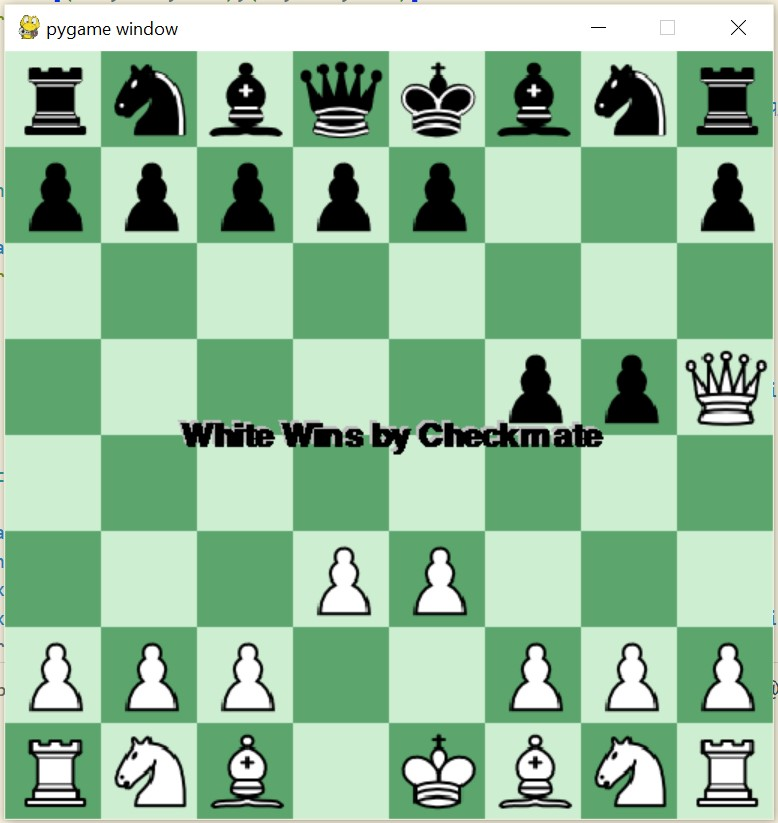

# Python Chess Engine

A fully functional Chess Engine built with Python and Pygame which can be manually played by two players. This project implements a complete chess ruleset including special moves, move validation, and game state management.

## Features

*   **Complete valid move generation**: The engine calculates all pseudo-legal moves and filters them based on checks and pins.
*   **Check & Checkmate Detection**: logic to detect when a King is in check, checkmate, or if the game is in a stalemate.
*   **Move Undo**: Press `z` to undo moves and step back through the game history.
*   **Graphical Interface**: Clean, responsive UI built with Pygame (512x512 resolution).
*   **Turn Management**: Validates turns and restricts movement to the side to move.

## Special Moves Implemented

This engine supports all standard chess special moves:

### 1. Castling
*   **Kingside (O-O)**: King moves two squares towards the rook (e.g., e1 to g1).
*   **Queenside (O-O-O)**: King moves two squares towards the queen-side rook (e.g., e1 to c1).
*   **Validation**: 
    *   Path between King and Rook must be clear.
    *   King cannot be in check.
    *   King cannot pass through or land on a square under attack.
    *   Neither King nor Rook must have moved previously.

### 2. En Passant
*   A special pawn capture that can occur immediately after a pawn makes a two-step move from its starting position.
*   The capturing pawn moves to the square passed over by the doubly-advanced pawn.
*   **Logic**: The engine tracks `enpassantPossible` squares transiently for one turn.

### 3. Pawn Promotion
*   When a pawn reaches the 8th rank (White) or 1st rank (Black).
*   **Current Behavior**: Pawns automatically promote to a **Queen**.

### 4. King Pinning
*   **Restriction**: A piece is "pinned" if moving it would expose the King to check.
*   **Logic**: The engine checks all moves to ensure they do not result in the King being under attack. Pinned pieces cannot move out of the line of attack.

## Variety of Moves & Rules Explained

The engine strictly enforces the rules of chess:

*   **Pawn Structure**:
    *   Moves forward 1 square.
    *   **First Move**: Option to move forward 2 squares (if path is clear).
    *   **Captures**: Diagonally forward only.
*   **Knights**: Move in an 'L' shape (2 squares in one cardinal direction, then 1 square perpendicular). The only piece that can "jump" over others.
*   **Bishops**: Move any number of squares diagonally.
*   **Rooks**: Move any number of squares horizontally or vertically.
*   **Queens**: Combine the power of Rook and Bishop (any direction).
*   **Kings**: Move 1 square in any direction.

## Controls

*   **Mouse Left Click**: Select piece / Move piece.
*   **z**: Undo last move.
*   **ESC**: Exit game.

## Game Over Conditions

The game detects and displays the following end states:

*   **Checkmate**:
    *   Occurs when the King is in check and has no legal moves to escape.
    *   **Visual**: The screen displays "White Wins by Checkmate" or "Black Wins by Checkmate".
    

  

*   **Stalemate**:
    *   Occurs when the King is **not** in check, but the player has no legal moves.
    *   **Visual**: The screen displays "Stalemate".

## Limitations & Future Enhancements

While full-featured, the current engine has some known limitations that serve as opportunities for future development:

### Known Limitations
*   **Insufficient Material Draw**: The engine does not automatically declare a draw for scenarios where checkmate is impossible (e.g., **King vs. King**, King + Bishop vs. King). The game will continue indefinitely in these states.
*   **3-Fold Repetition**: There is no automatic draw detection for repeating the same board state three times.
*   **50-Move Rule**: The game does not enforce the 50-move rule (draw if no pawn move or capture for 50 turns).

### Recommendations for Enhancements
*   **AI Opponent**: Implement a Minimax algorithm with Alpha-Beta pruning to allow playing against the computer.
*   **Sound Effects**: Add audio cues for moves, captures, and checkmate.
*   **Timer/Clock**: Implement a chess clock to limit thinking time per player.
*   **Move History UI**: Display a scrollable list of moves made during the game (PGN format).
